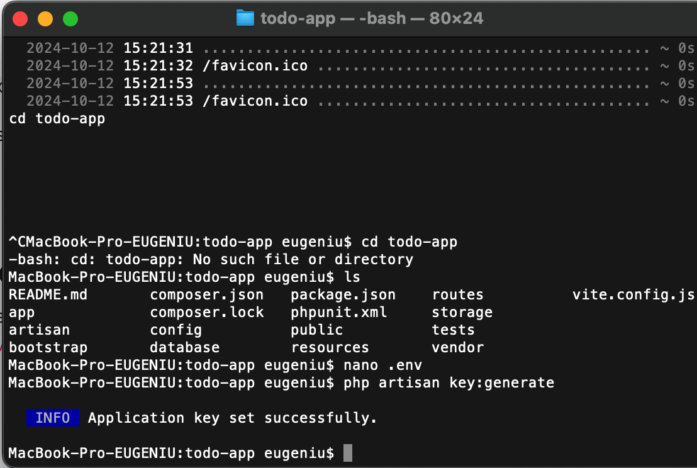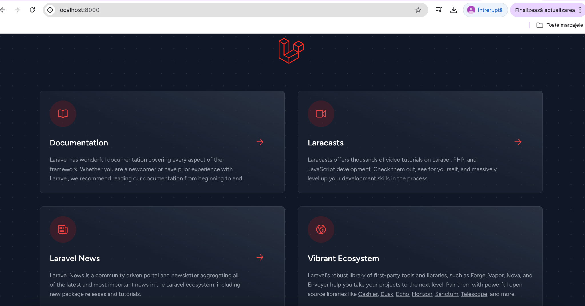

**Sarcina** **nr.1.** **Pregătirea** **pentru** **lucru,**
**instalarea** **Laravel**

Am deschis terminalul si am creat un proiect Laravel cu numele todo-app

Când deschid pagina
[<u>http://localhost:8000/</u>](http://localhost:8000/) în browser îmi
apare pagina de bun venit Laravel

**Sarcina** **nr.2.** **Configurarea** **mediului**

Am deschis fisierul .envsi am setat configurarile

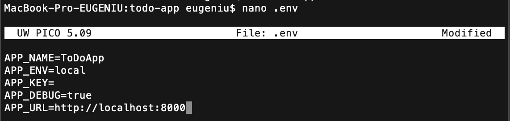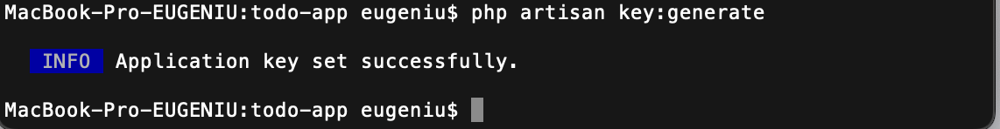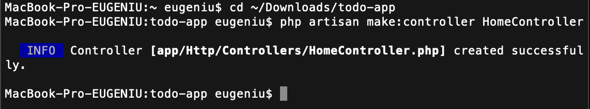

Am generat cheia aplicatiei , care este utilizata pentru criptarea
datelor : bash php artisan key:generate

Intrebare : Ce s-ar intimpla daca aceasta cheie ar ajunge pe mina unui
raufacator ?

Daca cheia ajunge in mainile unui raufacator, pot aparea mai multe
probleme serioase. In primul rand, acesta ar putea accesa date
sensibile, de exemplu, ar putea decripta parolele utilizatorilor sau
informatii confidentiale stocate in aplicatie. In al doilea rand, un
atacator ar putea genera sesiuni false, obtinand astfel controlul asupra
conturilor utilizatorilor. In plus, daca cheia este schimbata dupa
criptarea datelor, aceste informatii devin inaccesibile, deoarece nu mai
pot fi decriptate. Astfel, este esential sa protejezi aceasta cheie
pentru a asigura securitatea aplicatiei tale.

**Sarcina** **nr.3.** **Principiile** **de** **bază** **ale**
**lucrului** **cu** **cererile** **HTTP**

**3.1.** **Crearea** **rutelor** **pentru** **pagina** **principală**
**și** **pagina** **"Despre** **noi"**

Am creat un controller HomeControllerpentru gestionarea cererilor catre
pagina principala

Am adaugat metoda index in HomeController , care va afisa pagina
pricipala. Am creat ruta pentru pagina principala in fisierul
routes/web.php

php public function index() { return view(‘home’)

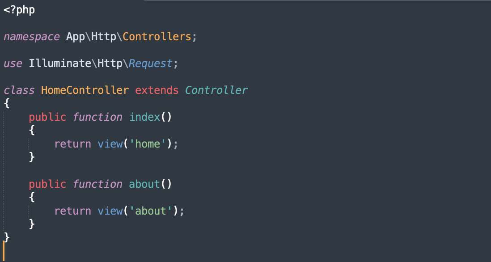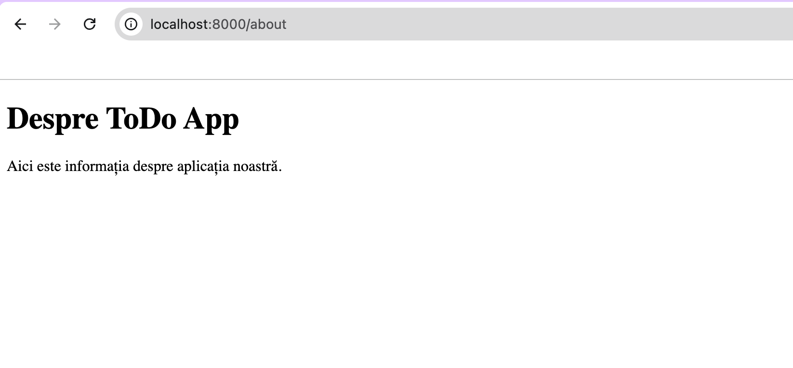

In acelasi controller HomeController , am creat o metoda pentru pagina
“Despre noi “ La fel am adaugat ruta pentru pagina “Despre noi” in
fisierul routes/web.php

**3.2.** **Crearea** **rutelor** **pentru** **sarcini**

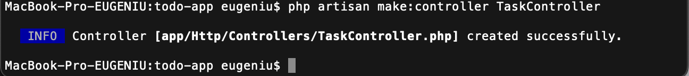Am creat un controller
‘TaskController’ pentru gestionarea cererilor legate de sarcini si am
adaugat urmatoarele metode

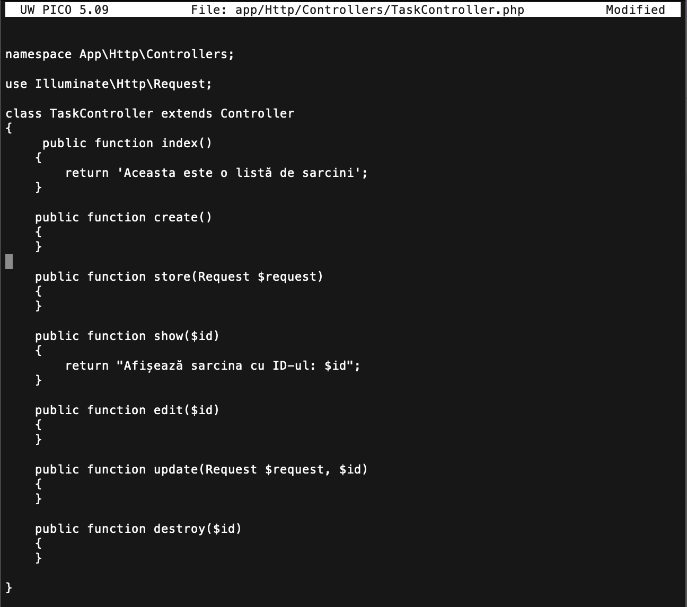

Am utilizat gruparea rutelor pentru controllerul ‘TaskController’ cu
prefixul ‘/task’ pentru a simplifica rutarea si a imbunatati
lizibilitatea codului

Am definit nume corecte pentru rutele controllerrului ‘TaskController’:

> ● **tasks.index**: Afiseaza lista de sarcini.
>
> ● **tasks.create**: Afiseaza formularul pentru crearea unei sarcini. ●
> **tasks.store**: Salveaza o sarcina noua.
>
> ● **tasks.show**: Afiseaza detaliile unei sarcini individuale pe baza
> ID-ului. ● **tasks.edit**: Afiseaza formularul pentru editarea unei
> sarcini existente. ● **tasks.update**: Actualizeaza o sarcina
> existenta.
>
> ● **tasks.destroy**: Sterge o sarcina existenta.

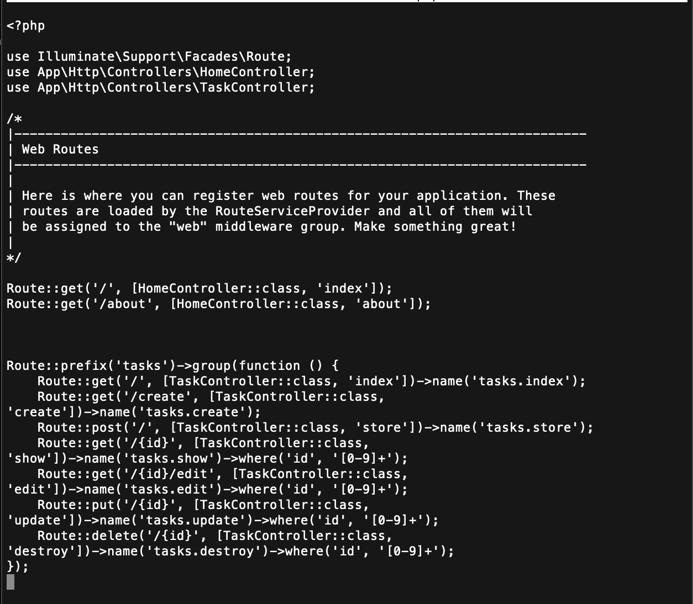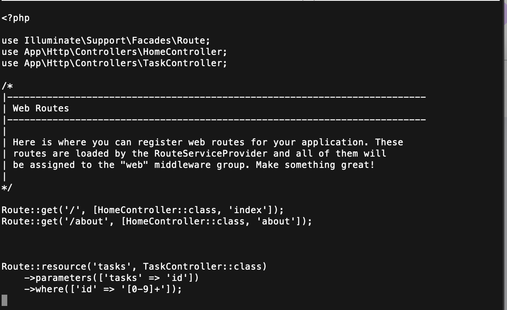

Am incercat ca in loc sa creez manual rute pentru fiecare metoda , sa
folosesc “un controller de resurse” care sa creeze rute pentru toate
operatiunile “CRUD”

Intrebare: Explicati diferenta intre crearea manuala a rutelor si
utilizarea unui controller de resurse . Ce rute si ce nume de rute vor
fi create automat ?

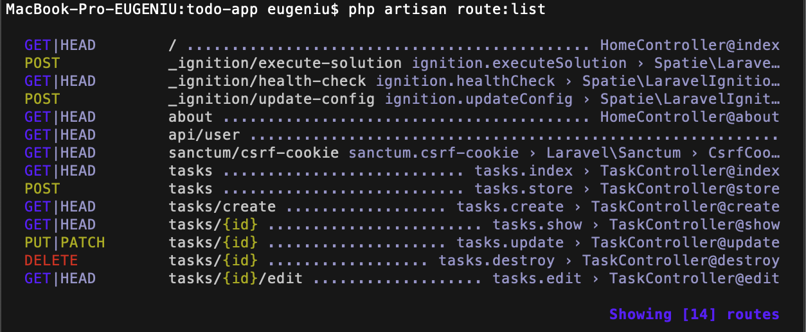

Crearea manuala a rutelor implica definirea fiecarei rute individual,
ceea ce poate duce la un cod mai lung si mai greu de intretinut .
Fiecare metoda a controller-ului necesita o linie separata de cod, ceea
ce face ca fisierul de rute sa devina aglomerat si mai putin lizibil.

Pe de alta parte, dupa observatiile din imaginile de mai sus ,rutele vor
functiona la fel dar utilizarea unui controller de resurse simplifica
acest proces. Printr-o singura comanda, Laravel genereaza automat rutele
necesare pentru toate operatiunile CRUD (Create, Read, Update, Delete).
Aceasta metoda nu doar ca reduce cantitatea de cod scris, dar si
imbunatateste organizarea si claritatea acestuia

Rutele create automat printr-un controller de resurse includ:

> ● tasks.index: pentru afisarea listei de sarcini (GET /tasks)
>
> ● tasks.create: pentru afisarea formularului de creare a unei sarcini
> (GET /tasks/create) ● tasks.store: pentru salvarea unei noi sarcini
> (POST /tasks)
>
> ● tasks.show: pentru afisarea detaliilor unei sarcini pe baza ID-ului
> (GET /tasks/{id})
>
> ● tasks.edit: pentru afisarea formularului de editare a unei sarcini
> (GET /tasks/{id}/edit) ● tasks.update: pentru actualizarea unei
> sarcini existente (PUT/PATCH /tasks/{id})
>
> ● tasks.destroy: pentru stergerea unei sarcini (DELETE /tasks/{id})

Am verificat rutele create cu ajutorul comenzii php artisan route:list

**Sarcina** **nr.4.** **Șablonizarea** **folosind** **Blade**

**4.1.** **Crearea** **unui** **layout** **pentru** **pagini**

Am creat un layoutpentru paginile principale cu urmatoarele elemente
comune ale paginii :

> 1\. Titlul paginii;
>
> 2\. Meniu de navigare; 3. Conținutul paginii;

Am folosit directiva @yieldpentru a defini zona in care va fi inserat
continutul paginii

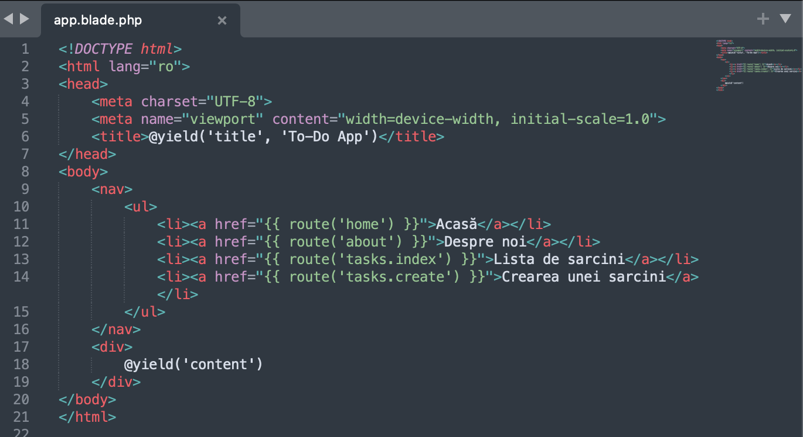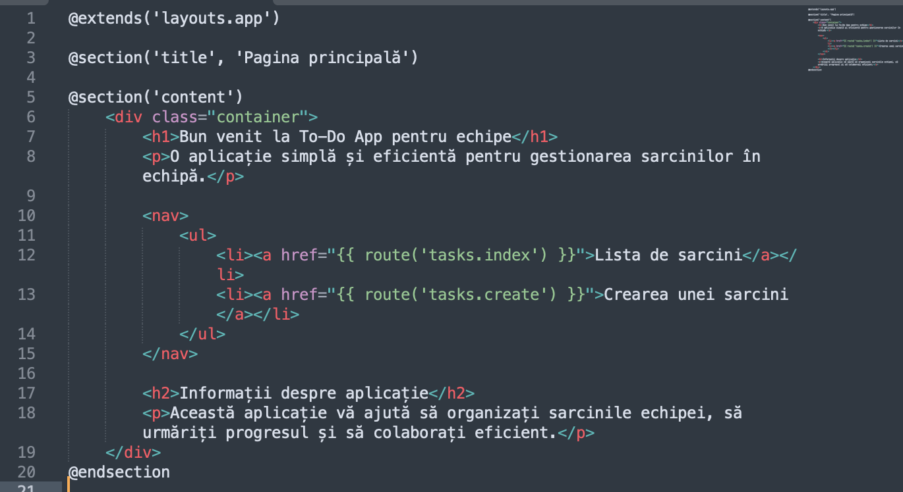

**4.2.** **Utilizarea** **șabloanelor** **Blade**

Vizualizare pentru pagina principala home.blade.php

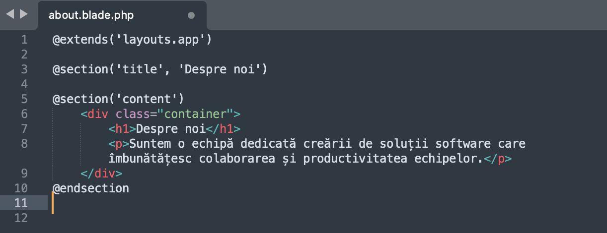Vizualizare pentru pagina
‘Despre noi’ about.blade.php

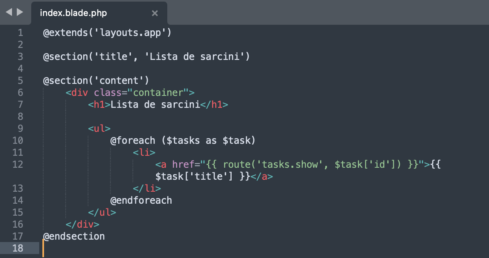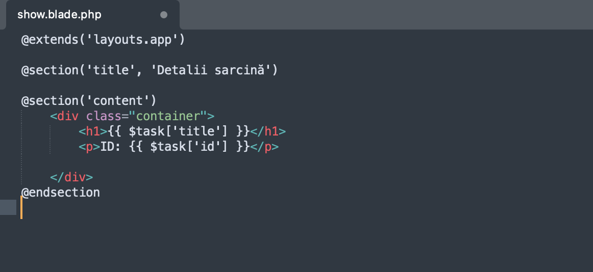

Vizualizare pentru pagina ‘Despre noi’ index.blade.php

Vizualizare pentru pagina ‘Despre noi’ show.blade.php

**Sarcina** **nr.4.3** **Componente** **anonime** **Blade**

Am creat o componenta anonima pentru afisarea antentului header

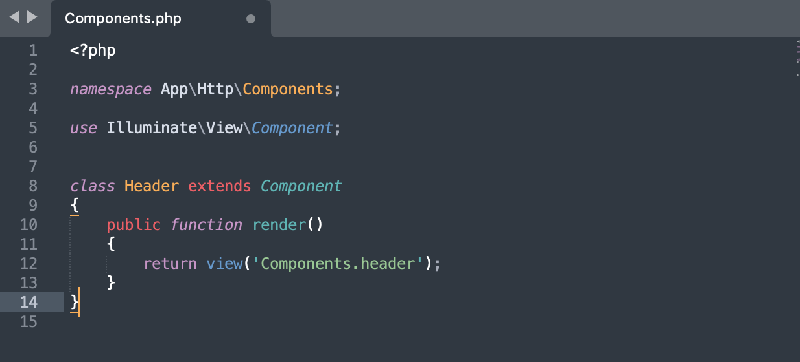Am folosit componenta creata
in layoutul layouts/app.blade.php

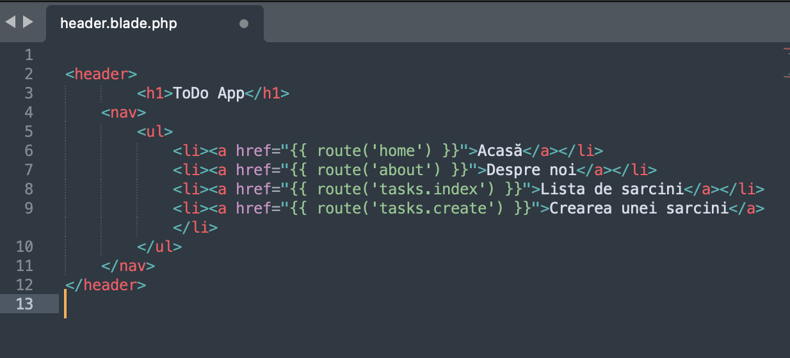

**Sarcina** **4.4.** **Stilizarea** **paginilor**

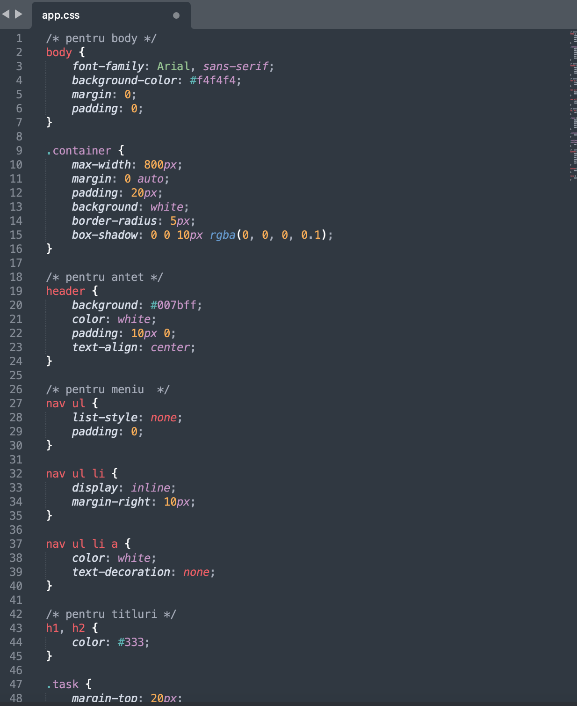Am adaugat stiluri pentru
pagini folosind CSS

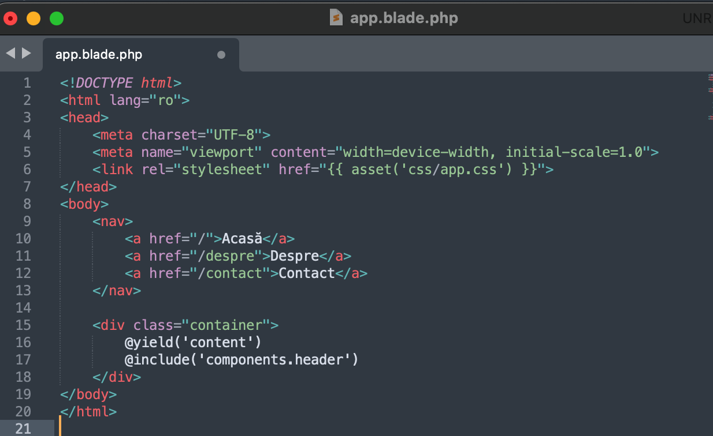
